<h2> Spring cloud with Frontend</h2>

<h2>1. Micro-service pour les produits</h2>
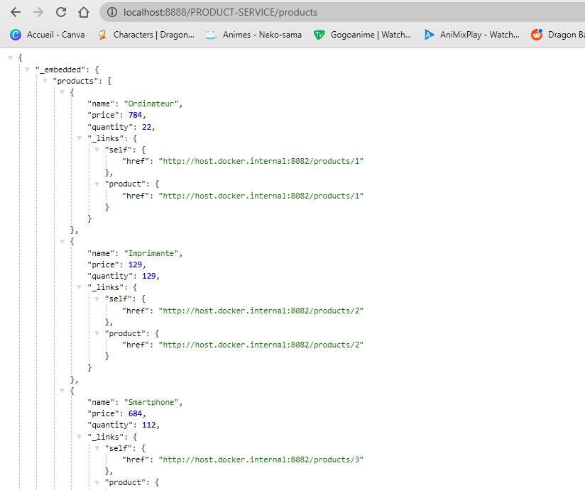
<h2>2. Micro-service pour les clients</h2>
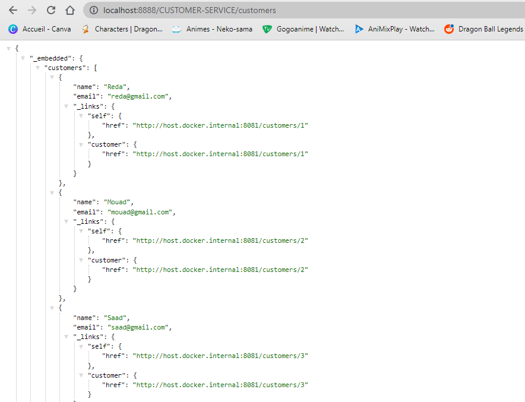
<h2>3. Eureka Discovery Service</h2>
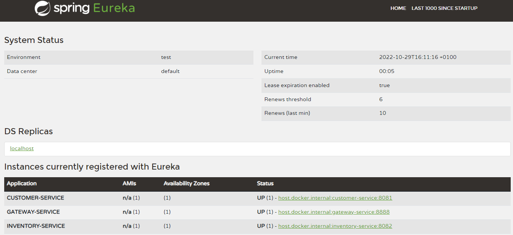
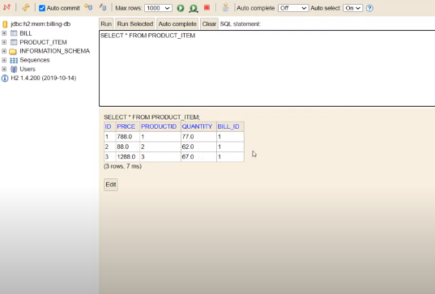
<h2>4. Spring Cloud Gateway </h2>
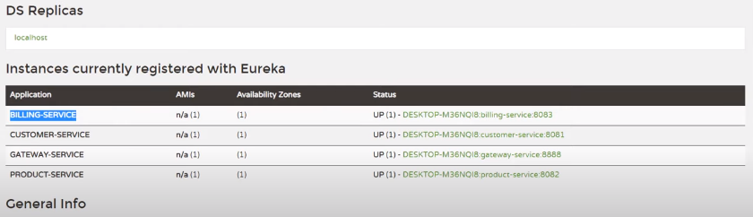
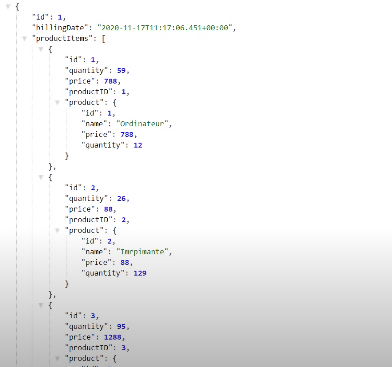
<h2>5. Micro-service pour Billing </h2>
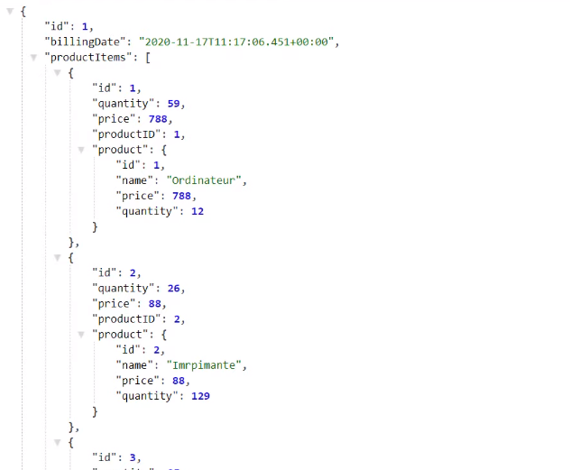
<h2>6. Client Web Angular "Clients"  </h2>
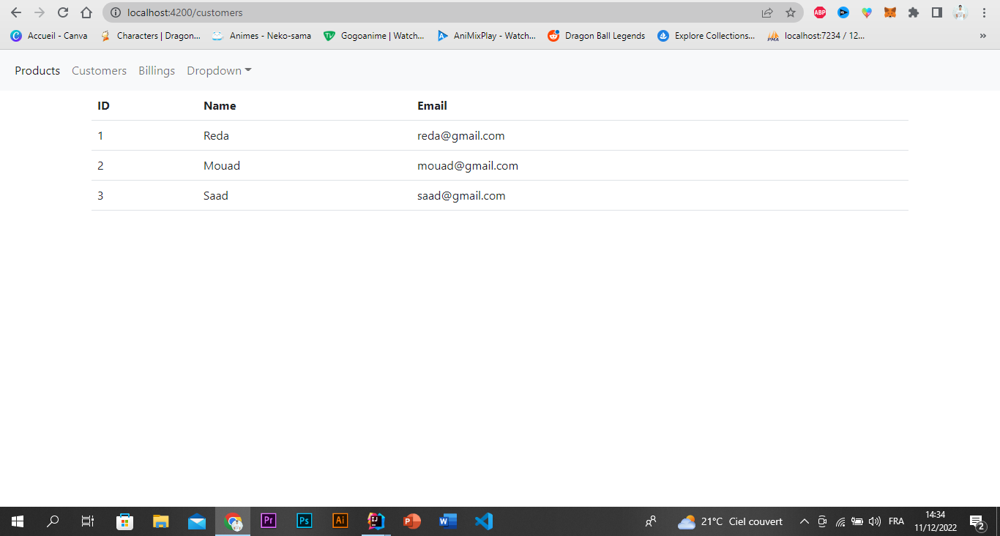
<h2>7. Client Web Angular "Produits"  </h2>
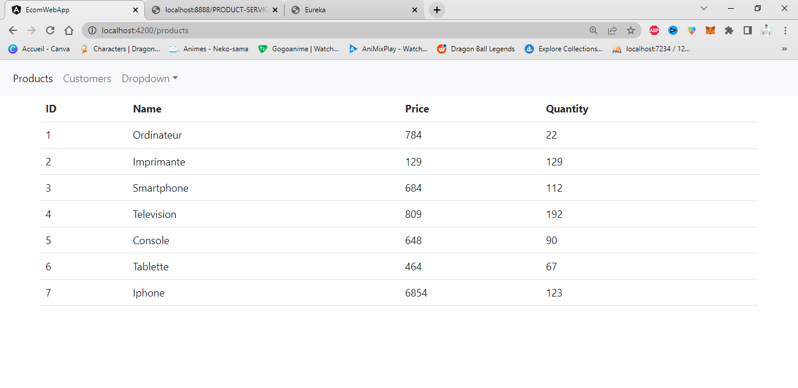
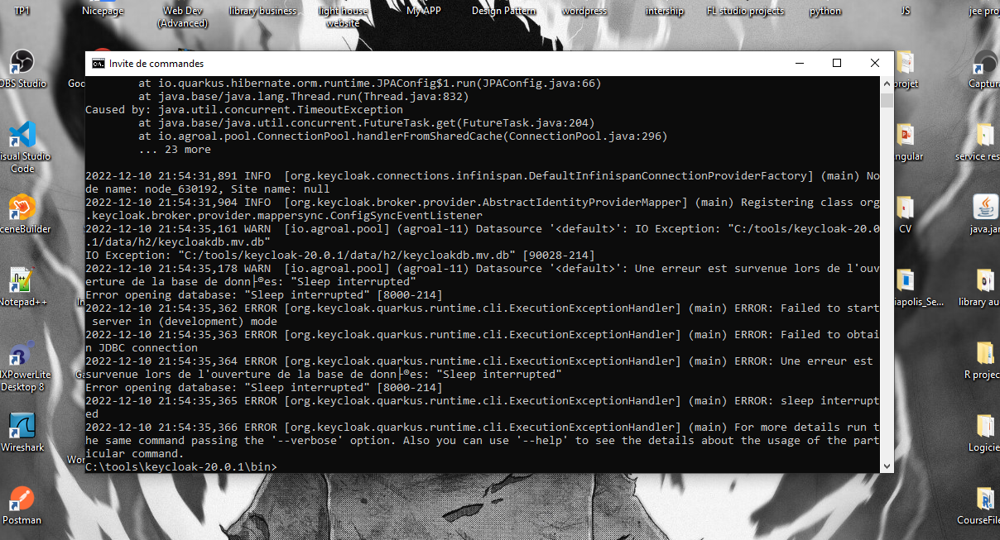
<h2>7. Serveur Keycloak</h2>
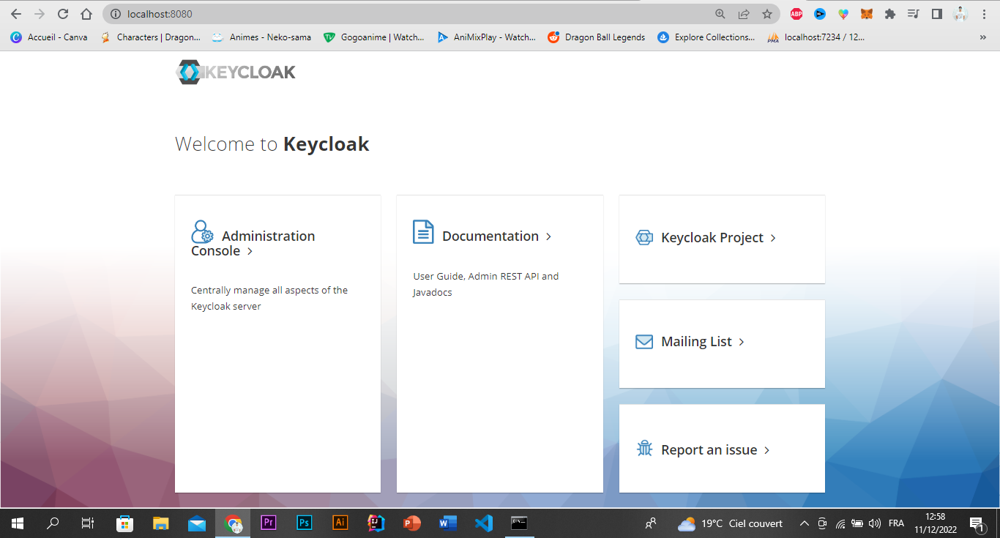
<h2>8. Authentification Keycloak</h2>
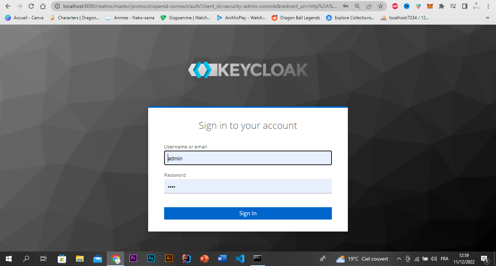
<h2>9. Creation des realms</h2>
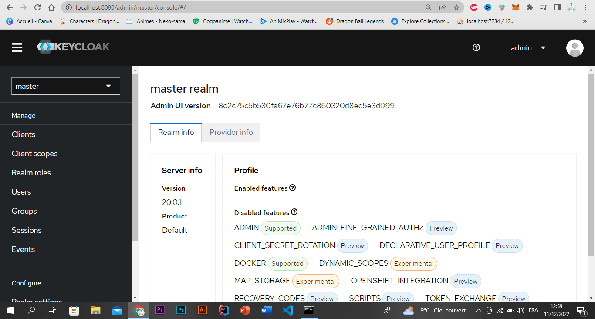
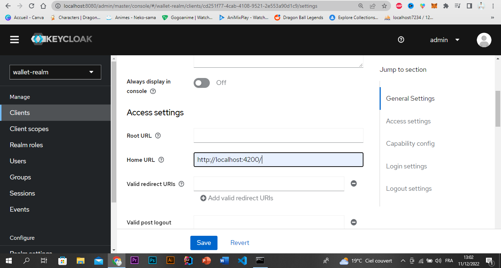
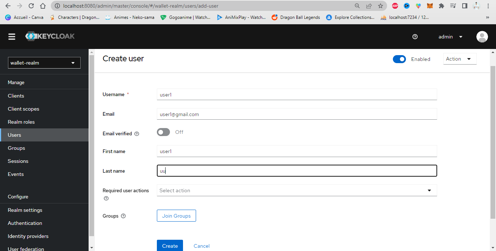
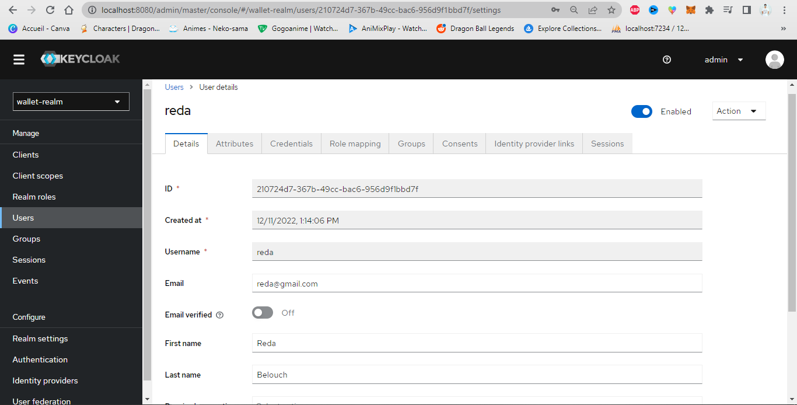
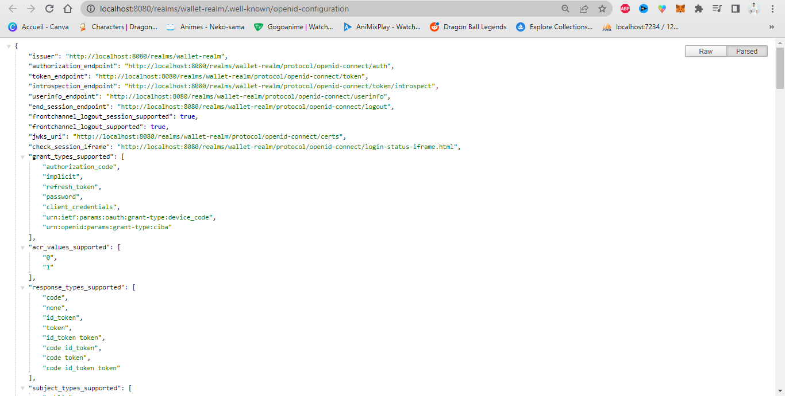
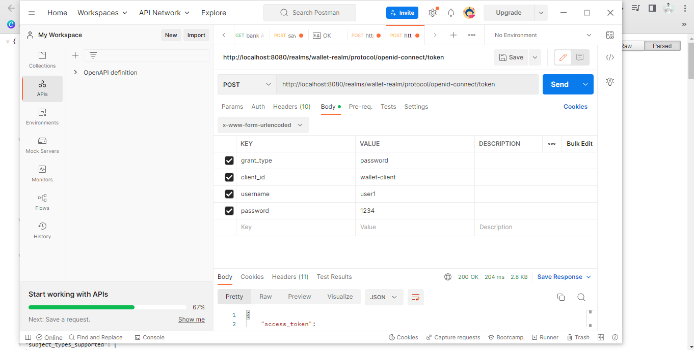
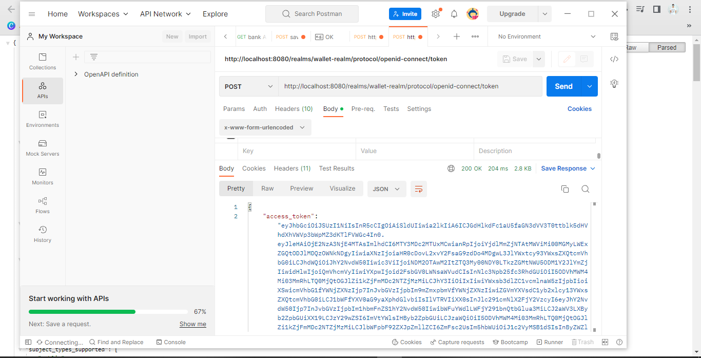
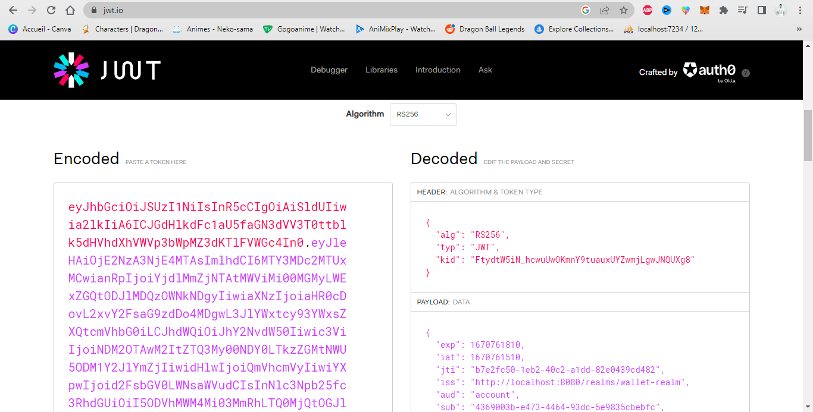

